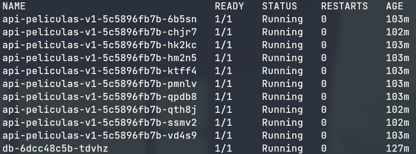

# Flask api-peliculas

This is project is a small API to pratice and learn about containers. This project uses
Docker and Kubernetes

## How to deploy

To deploy this project with Kubernetes you will need to set up your Kubernetes cluster.
To set it up using gcloud, please refer to the
[documentation](https://cloud.google.com/kubernetes-engine/docs/how-to/cluster-access-for-kubectl).

After setting your environment up, get your cluster credentials:
```
$ gcloud container clusters get-credentials credentials <your-cluster> --region=<region>
```
To deploy the data base use the following commands:
```
$ kubectl create -f postgres-deployment.yml
$ kubectl create -f postgres-service.yml
```
Then, you can deploy the API using these commands:
```
$ kubectl create -f api-deployment.yml
$ kubectl create -f api-service.yml
```
To check if everything is up and running, you can use the following command:
```
$ kubectl get pods
```

